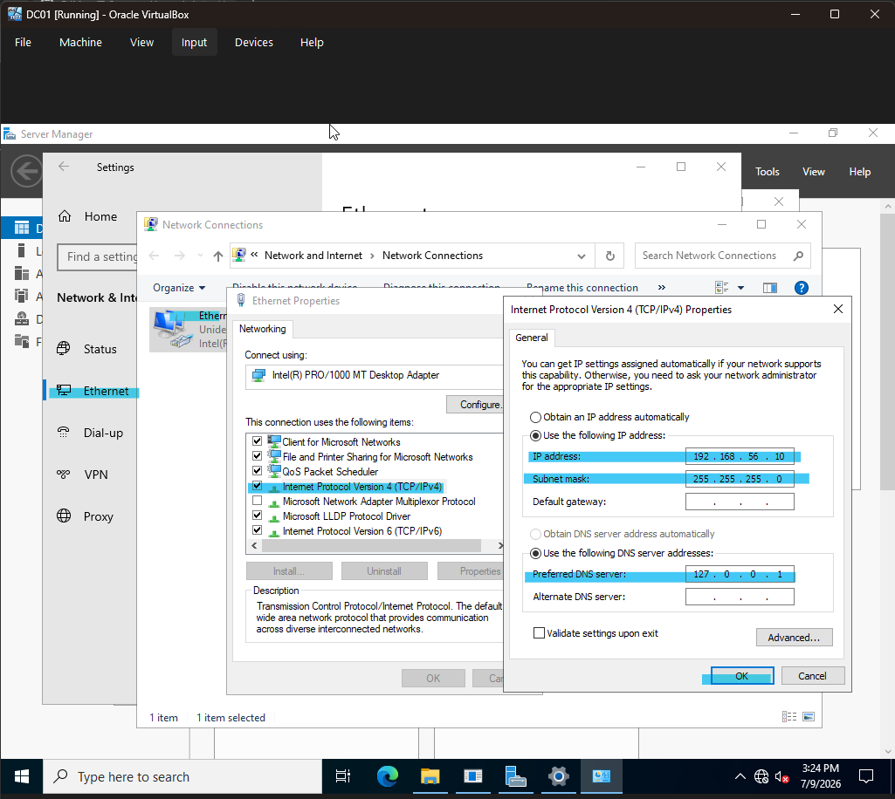
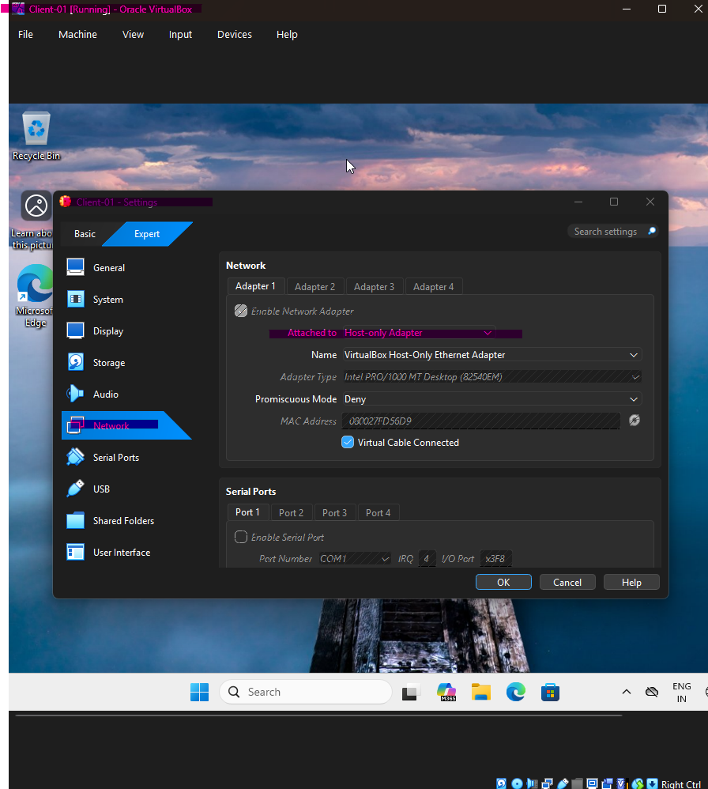
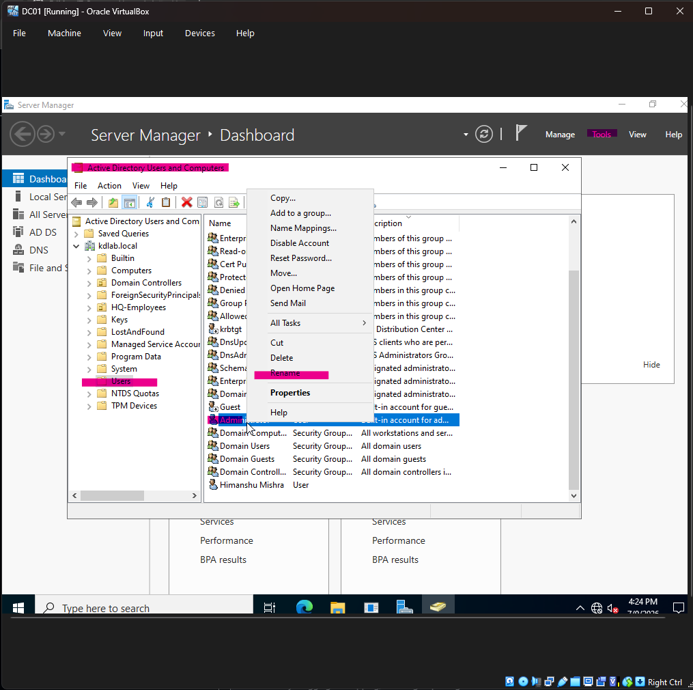
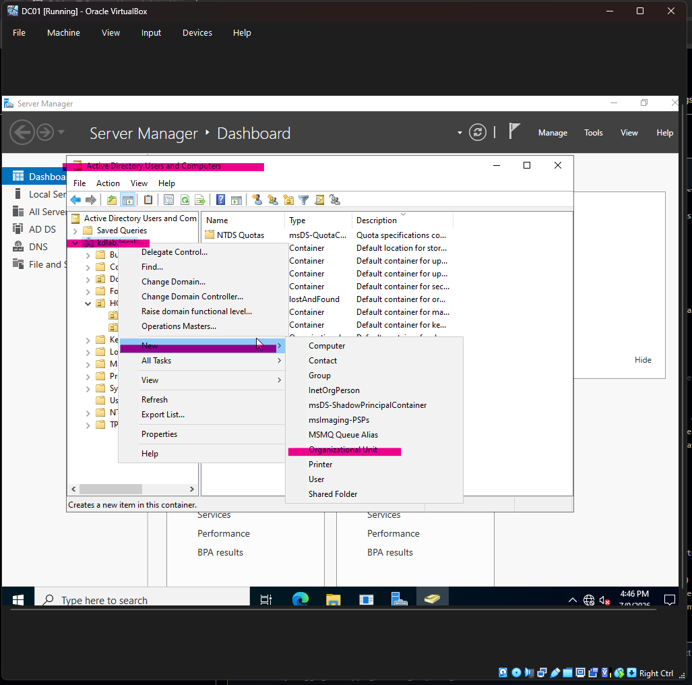
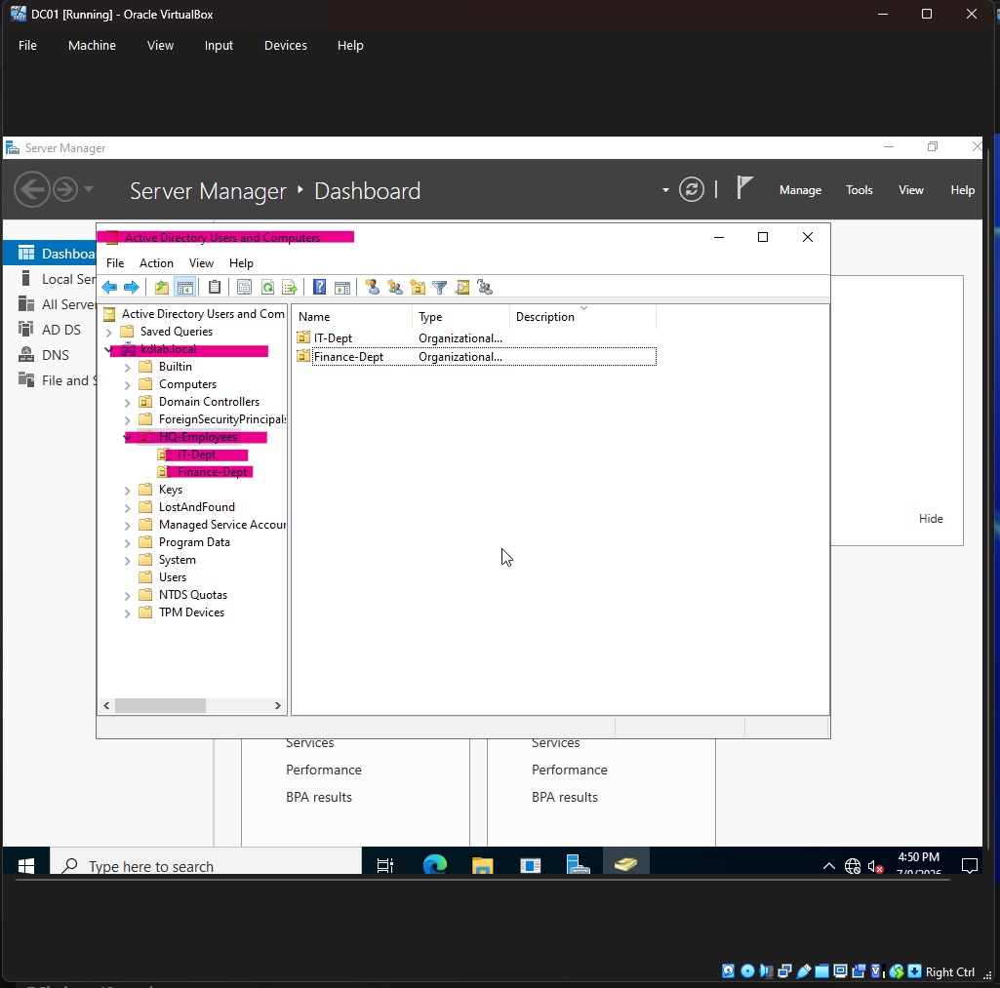

# IT Support Home Lab

## Project Overview
This project demonstrates the design, deployment, and management of a secure, centralized enterprise network infrastructure using Windows Server 2022 and a Windows 11 Client workstation. Operating inside an isolated virtual environment via VirtualBox, this lab simulates real-world corporate systems administration tasks including Domain Controller provisioning, Active Directory Domain Services (AD DS) management, Identity and Access Management (IAM), Group Policy Object (GPO) engineering, and secure network file systems (SMB/NTFS).

---

## 💻 Lab Hardware Specifications (Physical Host)
* **Processor:** AMD Ryzen 5 5600GT (6 Cores, 12 Threads @ 3.60 GHz)
* **Physical Memory:** 16 GB DDR4 RAM (Allocated dynamically to maintain host stability)
* **Storage Environment:** Dedicated high-capacity 160 GB secondary partition (E:\ Drive)
* **Hypervisor Platform:** Oracle VM VirtualBox (v7.0+ Architecture)

---

## 🛠️ Infrastructure Component Map
| Asset Name | Role Identity | Operating System | Allocated Resource Profile | Network Segment |
| :--- | :--- | :--- | :--- | :--- |
| **DC01** | Active Directory Domain Controller | Windows Server 2022 Standard | 4 GB RAM / 2 vCPU / 60 GB VDI | Host-Only Private Sandbox |
| **CLIENT01** | Enterprise Workplace Endpoint | Windows 11 Pro | 4 GB RAM / 2 vCPU / 50 GB VDI | Host-Only Private Sandbox |

---

## Network Topology & Technical Architecture
* **Domain Name:** `kdlab.local`
* **Network Interconnect:** Private Host-Only Virtual Network (Isolated Link)
* **Domain Controller (DC01):**
  * **Operating System:** Windows Server 2022 Standard Evaluation
  * **IP Address:** `192.168.56.10` (Static Assignment)
  * **Subnet Mask:** `255.255.255.0`
  * **Preferred DNS:** `127.0.0.1` (Internal Loopback Interface)
* **Workstation (Client-01):**
  * **Operating System:** Windows 11 Pro
  * **IP Address:** `192.168.56.x` (Dynamic Host-Only Range)
  * **Preferred DNS:** `192.168.56.10` (Points directly to DC01 Resolver)

---

## Phase 1: Virtual Infrastructure Architecture & Base OS Provisioning

### 1. Virtual Switch Virtualization
To ensure absolute network isolation and prevent conflict with residential internet gateways or corporate production DHCP servers, both virtual endpoints were explicitly mapped to a single network adapter bound to the **Host-Only Adapter** interface inside VirtualBox. This configuration mirrors an on-premises network framework cut off from the public web.

### 2. Base Operating System Deployments
* **Windows Server 2022:** Provisioned as the core root system infrastructure. Installed with Desktop Experience to support management consoles.
* **Windows 11 Pro:** Provisioned as the corporate endpoint machine. During the initial Windows Out-of-Box Experience (OOBE) setup, the integrated cloud network requirement script was bypassed using the administrative terminal command: `OOBE\BYPASSNRO`
* This forced the operating system installer to reboot and allow the creation of a standalone initial local administrator account named `Kirtiman Dwivedi`.

---

## Phase 2: Domain Controller Provisioning & Core Networking Services

### 1. Hardening Network Configurations (Static IP Implementation)
Core servers hosting directory architectures require persistent, un-changing IP addresses so network clients can reliably locate resolution systems.
* Accessed network interface properties on `DC01` and manually configured the static IPv4 address `192.168.56.10` with a subnet mask of `255.255.255.0`.
* Hardcoded the **Preferred DNS Server** value to `127.0.0.1` (Internal Loopback). This configuration mandates that the server resolve namespace definitions using its own local records database instead of standard public root servers.

### 2. Active Directory Installation & Forest Promotion
* Initiated the **Add Roles and Features Wizard** inside Server Manager and deployed the **Active Directory Domain Services** binary roles.
* Promoted the standalone server to a Domain Controller by launching the deployment engine and creating a brand new root forest namespace named `kdlab.local`. This operation initialized the global directory database catalog, built the directory structure, and provisioned the integrated primary lookup zones.

---

## Phase 3: Client Workstation Deployment & Domain Integration

### 1. Workstation Name Resolution Configuration
Before the Windows 11 workstation can register itself against the centralized domain infrastructure, it must know where to find the directory controller.
* Opened local network adapter settings on the Windows 11 workstation and targeted the **Preferred DNS Server** parameter directly to the Server IP address: `192.168.56.10`.

### 2. Name Resolution Testing
Executed an ICMP echo verification from the client terminal to confirm network layer routing and verify that the local DNS resolver successfully translates string domain definitions to network addresses by running the command `ping kdlab.local`.
* **Analysis Metrics:** 0% packet drop. The internal lookup engine instantly parsed the `kdlab.local` text namespace and received return packets directly from target IP `192.168.56.10`.

### 3. Executing the Active Domain Join
* Launched advanced system properties `sysdm.cpl` on the Windows 11 workstation interface.
* Modified the system's corporate identity environment from a standalone local Workgroup over to the domain structure: **Domain: `kdlab.local`**.
* Authenticated using the master domain `Administrator` user profile to authorize the machine account inside the server database.
* Successfully initialized the system reboot script to apply the domain integration parameters.

---

## Phase 4: Systems Architecture Deep-Dives

### 1. Architectural Analysis: The "Domain Admin" Illusion Explained
When a systems administrator logs into the Windows 11 client machine using the server's master administrative credentials (`kdlab\Administrator`), the client machine does not transform into a server operating system. It remains a standard Windows 11 installation. 

This access level is controlled by a hidden background mechanism known as **Local Group Nested Trust**. The moment `Client-01` joined the `kdlab.local` domain, its internal security architecture altered its local **Administrators** security group. It automatically injected a permanent trust rule stating: 
> *"I explicitly trust the security clearance of the `kdlab.local` Domain Controller. Therefore, any identity group member belonging to the **Domain Admins** group on that server automatically holds full Local Administrator privileges on this endpoint."*

When you log in, Windows 11 validates the password against the server. Once the server confirms identity, Windows 11 generates an elevated system token, unlocking full programmatic access to its local Registry, C:\ storage drive, and system databases.

### 2. Identity Security Logic: Local vs. Domain Accounts
Understanding where user credentials live under the hood is critical for systems management:
* **Local User Accounts:** This account's credentials, configurations, and identity exist exclusively inside a file called the **SAM (Security Accounts Manager) database** locked within the physical storage drive of `Client-01`. The central server has zero knowledge of its existence, cannot reset its password, and cannot track its activity.
* **Domain User Accounts:** These account identities live centrally inside the primary database engine (`ntds.dit`) on the Domain Controller. This architecture enables Single Sign-On (SSO) capacity, allowing these users to securely authenticate against *any* computer object connected to the network fabric.

### 3. Operating System Account Management: Tracking and Purging Zombie Local Profiles
Leaving unmanaged local profiles lingering on a domain-joined machine creates severe corporate security vulnerabilities. To permanently remove the original local staging account and clean up disk usage, use this administrative cleanup process:

#### Step A: Discovering the Account via Elevated Domain Access
1. Authenticated into `Client-01` using the master domain account `kdlab\Administrator`.
2. Right-clicked the Start Menu and launched **Computer Management**.
3. Navigated through `System Tools -> Local Users and Groups -> Users`. The local database display reveals the exact underlying account name for the user profile.

#### Step B: Wiping Profile Artifacts and Deleting the Account
1. Disconnected the account profile and registry footprints by opening the Run window and executing `sysdm.cpl`.
2. Navigated to the **Advanced** tab -> *User Profiles* section -> and clicked **Settings...**.
3. Highlighted the legacy account identifier labeled `CLIENT-01\Kirtiman Dwivedi` and clicked **Delete**. This operation purges the local folder structure (`C:\Users\Kirtiman`) and sweeps the system registry.
4. Returned to **Computer Management**, right-clicked the user name target, and selected **Delete** to erase it from the local user catalog.

### 4. Infrastructure Security Hardening: The Administrator Rename Protocol
Hacker scripts regularly target the default username "Administrator" during automated network brute-force attacks. To eliminate this security vector, the master account name can be obscured using two production techniques:

#### Option A: Global Workstation Lockdowns via GPO (Changes Client Local Admin Accounts)
1. Opened the **Group Policy Management Editor** on `DC01`.
2. Drilled down to: `Computer Configuration -> Policies -> Windows Settings -> Security Settings -> Local Policies -> Security Options`.
3. Located the policy rule: `Accounts: Rename administrator account` and double-clicked it.
4. Checked the validation box labeled **"Define this policy setting"** to unlock the configuration field.
5. Injected a secure, custom name (e.g., `KD-Boss` or `LabAdmin`) and committed the settings change.

#### Option B: Active Directory Direct Rename (Changes the Domain Controller Master Account Name)
1. Opened **Active Directory Users and Computers** on the server.
2. Navigated to the default **Users** folder interface.
3. Right-clicked the literal user object labeled **Administrator** and executed a direct **Rename** command.
4. Inputted the secure identity identifier (e.g., `KDAdmin`), pressed Enter, and confirmed the updated login string mappings within the verification window.

---

## Phase 5: Centralized Identity & Access Management (IAM)

To establish an enterprise directory framework, automated configurations must target structural compartments rather than loose account objects.

### 1. Organizational Unit (OU) Architecture
* Launched the directory management utility console `dsa.msc` on `DC01`.
* Constructed a root parent Organizational Unit container named `HQ-Employees`.
* Developed two scoped departmental sub-OUs nested beneath the parent folder structure: `IT-Dept` and `Finance-Dept`.

### 2. User & System Provisioning Workflows
* Created corporate domain identity profile **Himanshu Mishra** and mapped the account object directly into the `IT-Dept` OU.
* Created corporate domain identity profile **Rani Mishra** and mapped the account object directly into the `Finance-Dept` OU.
* Located the newly joined `Client-01` computer account object within the default system container and dragged it directly into the newly constructed, policy-targeted `HQ-Employees` parent OU.

---

## Phase 6: Production Support Tickets & Enterprise Security Deployments

The administrative configurations below represent real-world helpdesk remediation tasks executed across this dual-node testing environment.

### 🎫 Ticket 1: Cross-Departmental File Sharing Constraints (SMB Share & NTFS Security ACLs)
* **Ticket Request:** "Deploy a central file repository on our infrastructure server. Our IT engineering personnel require private storage space for technical tools, and our Finance staff require isolated access for accounting paperwork. Neither team should be able to view or edit the other's shared department folders."

#### Step 1: Physical Folder Provisioning & Gateway Access Configuration
1. Logged into `DC01` and generated a root folder named `C:\CompanyShares`. Inside, constructed two separate subdirectories: `IT-Data` and `Finance-Data`.
2. Opened properties for `C:\CompanyShares`, entered the **Sharing** tab, and clicked **Advanced Sharing...**.
3. Checked **Share this folder**, then opened the **Permissions** dashboard window.
4. Selected the generic entry group **Everyone**, granted them **Full Control**, and committed the changes. This opens the network gateway, shifting actual security evaluations down to the local file system layer.

#### Step 2: Fine-Grained NTFS Security Hardening
1. Opened file system properties for the `IT-Data` folder and accessed the **Security** tab -> **Advanced** settings window.
2. Clicked **Disable inheritance** and selected **"Convert inherited permissions into explicit permissions on this object"** to sever parent folder rules.
3. Removed the generic built-in user entry groups (`Users`, `Authenticated Users`).
4. Clicked **Add...**, searched for domain user account **`Himanshu`**, and granted his identity explicit **Modify** access rights.
5. Executed identical steps for the `Finance-Data` directory, removing public users, and granting explicit **Modify** privileges exclusively to domain user account **`Rani`**.

#### Step 3: Workstation Mounting and Security Validation
1. Logged onto `Client-01` using **Himanshu's** account credentials.
2. Launched a Run box, typed the server network file path: `\\192.168.56.10\CompanyShares` or simple the path which is being shown on clicking on the properties tab on the folder CompanyShare it will be something like `\\DC01\CompanyShares`, and hit Enter.
3. Right-clicked the visible `CompanyShares` folder structure and selected **Map network drive...**, locking it to local system path `Z:`.
4. **The Security Proof:** Verified that Himanshu can read, write, and generate text documents inside `IT-Data`. Attempted to access `Finance-Data` and verified that Windows instantly throws an explicit security blocking prompt.
5. After this both the users should access only allocated resources to them and should get a warning of denied permission on accessing the other folder.

 created.png)

***

### 🎫 Ticket 2: Brute-Force Authentication Defense (Account Lockout Policy Engineering)
* **Ticket Request:** "Our cybersecurity audit requires proactive network defenses to mitigate brute-force guessing attacks targeting user passwords. Enforce an automated network lockout rule across the infrastructure."

#### Step 1: Engineering the Lockout GPO Constraint
1. Opened the **Group Policy Management Console** (`gpmc.msc`) on `DC01`.
2. Expanded the forest tree, right-clicked the global **Default Domain Policy** container, and selected **Edit...**.
3. Navigated through this security path: `Computer Configuration -> Policies -> Windows Settings -> Security Settings -> Account Policies -> Account Lockout Policy`.
4. Configured and enabled these security parameters:
   * **Account lockout threshold:** Trigger lockouts at exactly `3` invalid login attempts.
   * **Account lockout duration:** Set the temporary security freeze timer to `15` minutes.
5. Closed the policy editing interface.

#### Step 2: Triggering the Attack Vector and Executing System Remediation
1. Shifted focus to the `Client-01` workstation terminal and executed a remote policy pull override string: `gpupdate /force`
2. Logged out of the system, selected **Rani Mishra's** domain login option, and intentionally typed an invalid password three consecutive times.
3. On the third bad password attempt, the operating system security engine blocked further login attempts, throwing a security alert window.

4. To resolve the user lockout, returned to the server AD console (`dsa.msc`), found Rani's properties window, navigated to the **Account** tab, checked the box labeled **"Unlock account"**, and hit Apply to restore her login rights.

***

### 🎫 Ticket 3: Centralized Endpoint Patch Compliance Enforcement
* **Ticket Request:** "Workstation end-users are continually pausing or bypassing critical Windows operating system updates, leaving our corporate endpoints exposed to software vulnerabilities. Implement a mandatory patch schedule and remove all local user update controls."

#### Step 1: Constructing the Windows Update Deployment GPO
1. Opened `gpmc.msc` on the server machine console.
2. Right-clicked the parent container target **`HQ-Employees`** OU, selected **"Create a GPO in this domain, and Link it here..."**, and titled it **`Windows_Update_Enforcement_GPO`**.
3. Right-clicked the GPO file asset and chose **Edit...**.
4. Carefully drilled down to this specific path: `Computer Configuration -> Policies -> Administrative Templates -> Windows Components -> Windows Update -> Manage end user experience`.

#### Step 2: Enforcing Mandatory Compliance Keys
Double-clicked and configured these three critical enterprise update settings:
1. **Configure Automatic Updates:** Set to **Enabled**. Adjusted the automated deployment logic to **Option 4 - Auto download and schedule the install**. Scheduled the execution engine to deploy **Every Wednesday at 03:00 AM**.
2. **No auto-restart with logged-on users for scheduled automatic updates installations:** Set to **Enabled**. This prevents the system from rebooting if users are working late or running critical overnight tasks.
3. **Remove access to "Pause updates" feature:** Set to **Enabled** to remove system management controls from the end user.

#### Step 3: Syncing Configurations and Verifying Compliance on Client
1. Signed into the `Client-01` machine and initiated a local group policy refresh command inside PowerShell: `gpupdate /force`
2. Launched the Windows 11 **Settings App** and opened the **Windows Update** menu.
3. **Verification Output:** A gray warning notification appeared stating: **"*Some settings are managed by your organization"**. The tracking interface confirmed that the pause options are grayed out, and the update schedule is hardcoded to the server's rulebook.

---

## Technical Competencies Matrix
* **Virtualization Infrastructure Engineering:** Provisioned isolated virtual switches, mapped internal adapters, and managed isolated environments within VirtualBox.
* **Core Network Administration:** Managed static IPv4 allocations, handled subnet calculations, and implemented local loopback DNS zone logic.
* **Active Directory Directory Services (AD DS):** Deployed root forest architectures, constructed Organizational Units, and managed security groups.
* **Identity & Access Management (IAM):** Provisioned domain user accounts, tracked active SIDs, managed directory object lifecycles, and handled helpdesk lockouts.
* **Group Policy Object (GPO) Design:** Engineered baseline security rulebooks, targeted rules at specific OUs, handled policy sync processing, and deployed system rules.
* **Storage Systems Hardening:** Implemented SMB protocols, disabled permission inheritance, and configured NTFS access control lists (ACLs).
* **Corporate IT Helpdesk Workflow:** Handled user ticketing procedures, managed remote troubleshooting, tracked configuration testing, and wrote professional technical documentation.
