# IT Support Home Lab

## Project Overview
This project demonstrates the design, deployment, and management of a secure, centralized enterprise network infrastructure using Windows Server 2022 and a Windows 11 Client workstation. Operating inside an isolated virtual environment via VirtualBox, this lab simulates real-world corporate systems administration tasks including Domain Controller provisioning, Active Directory Domain Services (AD DS) management, Identity and Access Management (IAM), Group Policy Object (GPO) engineering, and secure network file systems (SMB/NTFS).

---

## 💻 Lab Hardware Specifications (Physical Host)
* **Processor:** AMD Ryzen 5 5600GT (6 Cores, 12 Threads @ 3.60 GHz)
* **Physical Memory:** 16 GB DDR4 RAM (Allocated dynamically to maintain host stability)
* **Storage Environment:** Dedicated high-capacity 160 GB secondary partition (E:\ Drive)
* **Hypervisor Platform:** Oracle VM VirtualBox (v7.0+ Architecture)

---

## 🛠️ Infrastructure Component Map
| Asset Name | Role Identity | Operating System | Allocated Resource Profile | Network Segment |
| :--- | :--- | :--- | :--- | :--- |
| **DC01** | Active Directory Domain Controller | Windows Server 2022 Standard | 4 GB RAM / 2 vCPU / 60 GB VDI | Host-Only Private Sandbox |
| **CLIENT01** | Enterprise Workplace Endpoint | Windows 11 Pro | 4 GB RAM / 2 vCPU / 50 GB VDI | Host-Only Private Sandbox |

---

## Skills Demonstrated
- VirtualBox VM creation and network configuration
- Windows Server 2022 installation and initial setup
- Active Directory Domain Services (AD DS) installation and forest creation
- Static IP addressing and DNS configuration on a domain controller
- DHCP server setup and scope configuration
- Windows 11 domain join process
- Organisational Unit (OU) structure design
- User account and security group creation and management
- Group Policy Object (GPO) creation, linking, and testing
- SMB file sharing with NTFS permission hardening
- Account lockout policy configuration
- Delegation of Control for scoped helpdesk permissions
- PowerShell for Active Directory administration
- CLI troubleshooting (ipconfig, ping, nslookup, gpupdate, net user)

---

## Network Topology & Technical Architecture
* **Domain Name:** `kdlab.local`
* **Network Interconnect:** Private Host-Only Virtual Network (Isolated Link)
* **Domain Controller (DC01):**
  * **Operating System:** Windows Server 2022 Standard Evaluation
  * **IP Address:** `192.168.56.10` (Static Assignment)
  * **Subnet Mask:** `255.255.255.0`
  * **Preferred DNS:** `127.0.0.1` (Internal Loopback Interface)
* **Workstation (Client-01):**
  * **Operating System:** Windows 11 Pro
  * **IP Address:** `192.168.56.x` (Dynamic Host-Only Range)
  * **Preferred DNS:** `192.168.56.10` (Points directly to DC01 Resolver)

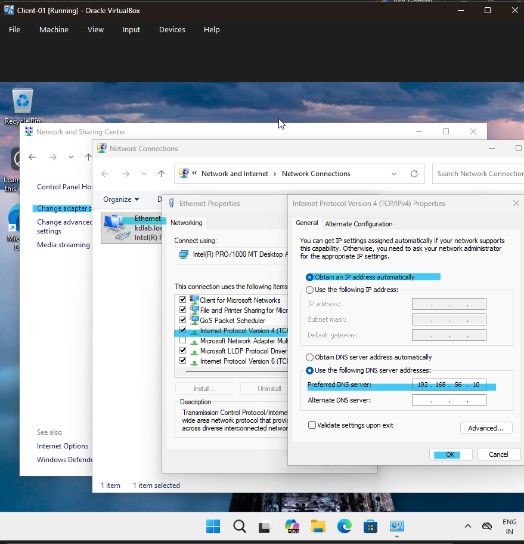

---

## Phase 1: Virtual Infrastructure Architecture & Base OS Provisioning

### 1. Virtual Switch Virtualization
To ensure absolute network isolation and prevent conflict with residential internet gateways or corporate production DHCP servers, both virtual endpoints were explicitly mapped to a single network adapter bound to the **Host-Only Adapter** interface inside VirtualBox. This configuration mirrors an on-premises network framework cut off from the public web.

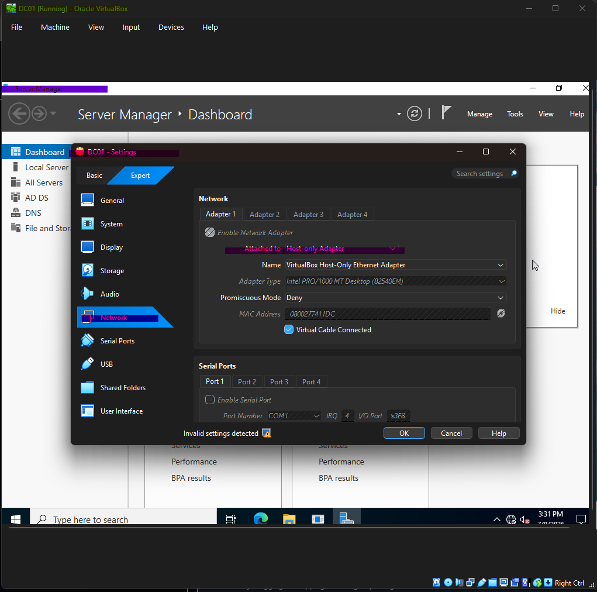

### 2. Base Operating System Deployments
* **Windows Server 2022:** Provisioned as the core root system infrastructure. Installed with Desktop Experience to support management consoles.
* **Windows 11 Pro:** Provisioned as the corporate endpoint machine. During the initial Windows Out-of-Box Experience (OOBE) setup, the integrated cloud network requirement script was bypassed using the administrative terminal command: `OOBE\BYPASSNRO`
* This forced the operating system installer to reboot and allow the creation of a standalone initial local administrator account named `Kirtiman Dwivedi`.

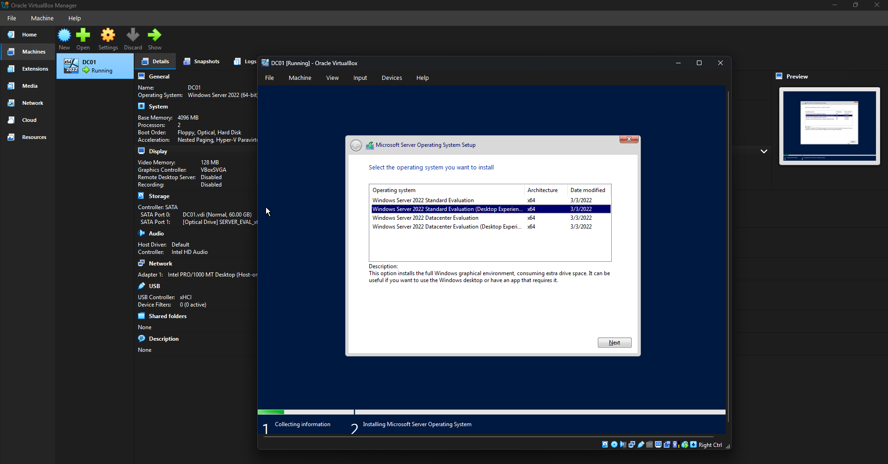

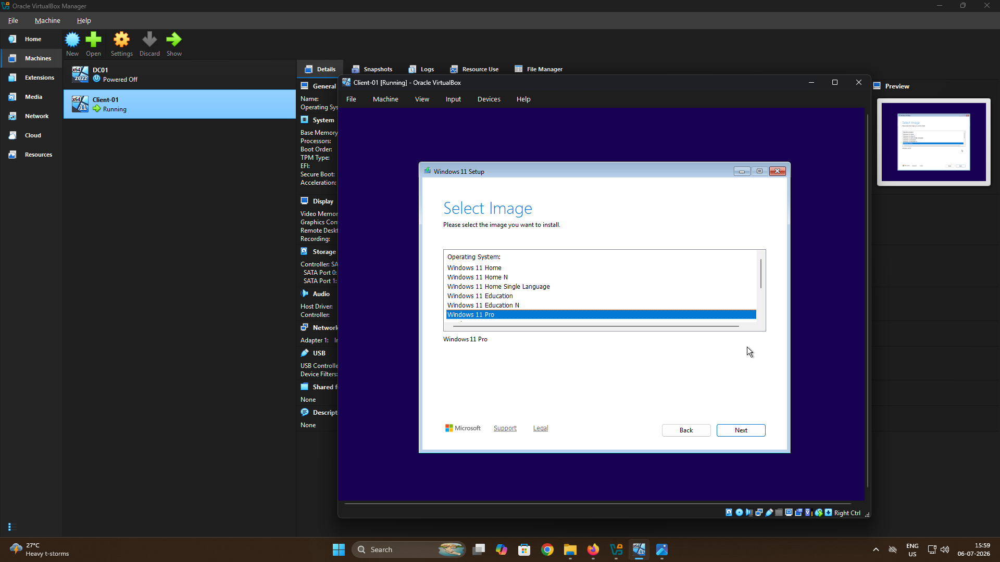

---

## Phase 2: Domain Controller Provisioning & Core Networking Services

### 1. Hardening Network Configurations (Static IP Implementation)
Core servers hosting directory architectures require persistent, un-changing IP addresses so network clients can reliably locate resolution systems.
* Accessed network interface properties on `DC01` and manually configured the static IPv4 address `192.168.56.10` with a subnet mask of `255.255.255.0`.
* Hardcoded the **Preferred DNS Server** value to `127.0.0.1` (Internal Loopback). This configuration mandates that the server resolve namespace definitions using its own local records database instead of standard public root servers.

### 2. Active Directory Installation & Forest Promotion
* Initiated the **Add Roles and Features Wizard** inside Server Manager and deployed the **Active Directory Domain Services** binary roles.
* Promoted the standalone server to a Domain Controller by launching the deployment engine and creating a brand new root forest namespace named `kdlab.local`. This operation initialized the global directory database catalog, built the directory structure, and provisioned the integrated primary lookup zones.

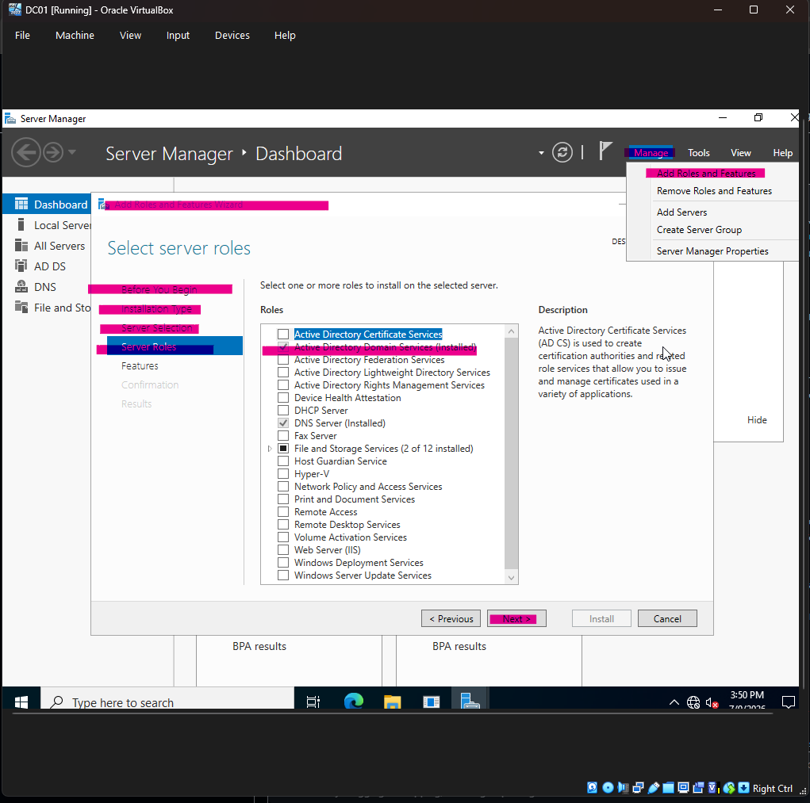

---

## Phase 3: Client Workstation Deployment & Domain Integration

### 1. Workstation Name Resolution Configuration
Before the Windows 11 workstation can register itself against the centralized domain infrastructure, it must know where to find the directory controller.
* Opened local network adapter settings on the Windows 11 workstation and targeted the **Preferred DNS Server** parameter directly to the Server IP address: `192.168.56.10`.

### 2. Name Resolution Testing
Executed an ICMP echo verification from the client terminal to confirm network layer routing and verify that the local DNS resolver successfully translates string domain definitions to network addresses by running the command `ping kdlab.local`.
* **Analysis Metrics:** 0% packet drop. The internal lookup engine instantly parsed the `kdlab.local` text namespace and received return packets directly from target IP `192.168.56.10`.

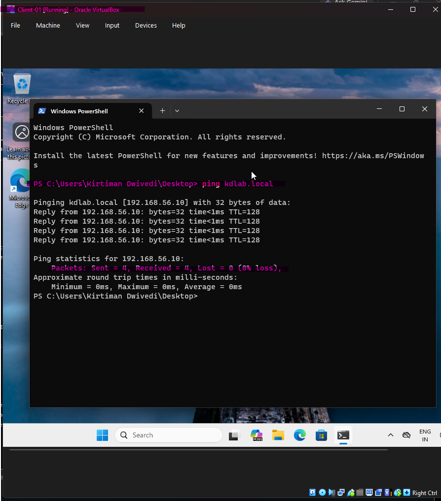

### 3. Executing the Active Domain Join
* Launched advanced system properties `sysdm.cpl` on the Windows 11 workstation interface.
* Modified the system's corporate identity environment from a standalone local Workgroup over to the domain structure: **Domain: `kdlab.local`**.
* Authenticated using the master domain `Administrator` user profile to authorize the machine account inside the server database.
* Successfully initialized the system reboot script to apply the domain integration parameters.

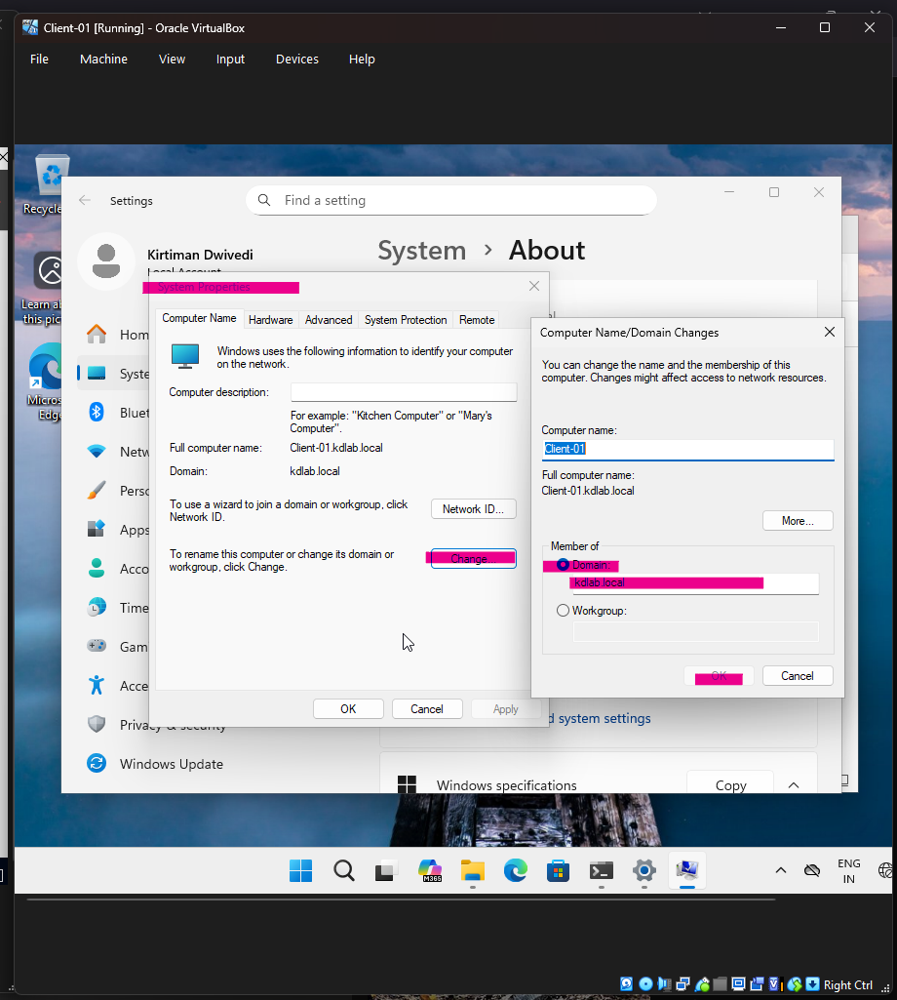

---

## Phase 4: Centralized Identity & Access Management (IAM)

To establish an enterprise directory framework, automated configurations must target structural compartments rather than loose account objects.

### 1. Organizational Unit (OU) Architecture
* Launched the directory management utility console `dsa.msc` on `DC01`.
* Constructed a root parent Organizational Unit container named `HQ-Employees`.
* Developed two scoped departmental sub-OUs nested beneath the parent folder structure: `IT-Dept` and `Finance-Dept`.

### 2. User & System Provisioning Workflows
* Created corporate domain identity profile **Himanshu Mishra** and mapped the account object directly into the `IT-Dept` OU.
* Created corporate domain identity profile **Rani Mishra** and mapped the account object directly into the `Finance-Dept` OU.
* Located the newly joined `Client-01` computer account object within the default system container and dragged it directly into the newly constructed, policy-targeted `HQ-Employees` parent OU.

---

## Phase 5: Production Support Tickets & Enterprise Security Deployments

The administrative configurations below represent real-world helpdesk remediation tasks executed across this dual-node testing environment.

### 🎫 Ticket 1: Cross-Departmental File Sharing Constraints (SMB Share & NTFS Security ACLs)
* **Ticket Request:** "Deploy a central file repository on our infrastructure server. Our IT engineering personnel require private storage space for technical tools, and our Finance staff require isolated access for accounting paperwork. Neither team should be able to view or edit the other's shared department folders."

#### Step 1: Physical Folder Provisioning & Gateway Access Configuration
1. Logged into `DC01` and generated a root folder named `C:\CompanyShares`. Inside, constructed two separate subdirectories: `IT-Data` and `Finance-Data`.
2. Opened properties for `C:\CompanyShares`, entered the **Sharing** tab, and clicked **Advanced Sharing...**.
3. Checked **Share this folder**, then opened the **Permissions** dashboard window.
4. Selected the generic entry group **Everyone**, granted them **Full Control**, and committed the changes. This opens the network gateway, shifting actual security evaluations down to the local file system layer.

#### Step 2: Fine-Grained NTFS Security Hardening
1. Opened file system properties for the `IT-Data` folder and accessed the **Security** tab -> **Advanced** settings window.
2. Clicked **Disable inheritance** and selected **"Convert inherited permissions into explicit permissions on this object"** to sever parent folder rules.
3. Removed the generic built-in user entry groups (`Users`, `Authenticated Users`).
4. Clicked **Add...**, searched for domain user account **`Himanshu`**, and granted his identity explicit **Modify** access rights.
5. Executed identical steps for the `Finance-Data` directory, removing public users, and granting explicit **Modify** privileges exclusively to domain user account **`Rani`**.

#### Step 3: Workstation Mounting and Security Validation
1. Logged onto `Client-01` using **Himanshu's** account credentials.
2. Launched a Run box, typed the server network file path: `\\192.168.56.10\CompanyShares` or simple the path which is being shown on clicking on the properties tab on the folder CompanyShare it will be something like `\\DC01\CompanyShares`, and hit Enter.
3. Right-clicked the visible `CompanyShares` folder structure and selected **Map network drive...**, locking it to local system path `Z:`.
4. **The Security Proof:** Verified that Himanshu can read, write, and generate text documents inside `IT-Data`. Attempted to access `Finance-Data` and verified that Windows instantly throws an explicit security blocking prompt.
5. After this both the users should access only allocated resources to them and should get a warning of denied permission on accessing the other folder.

_created.png)

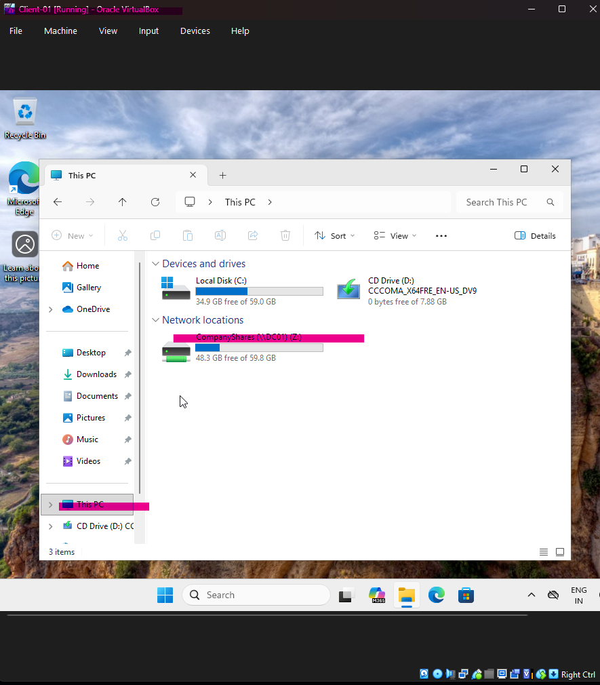

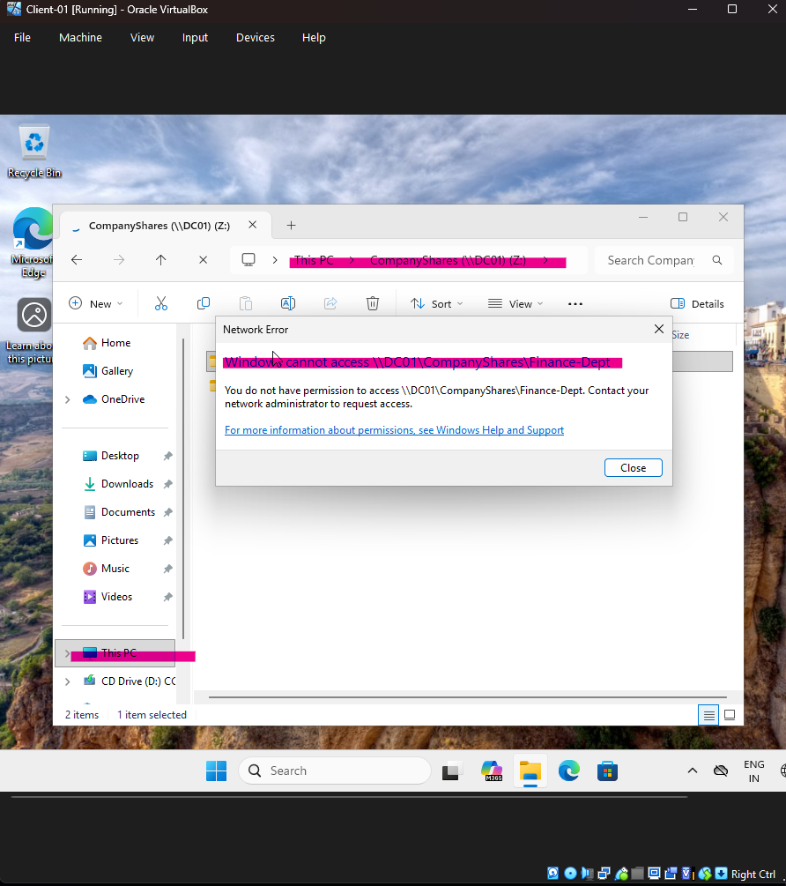

***

### 🎫 Ticket 2: Brute-Force Authentication Defense (Account Lockout Policy Engineering)
* **Ticket Request:** "Our cybersecurity audit requires proactive network defenses to mitigate brute-force guessing attacks targeting user passwords. Enforce an automated network lockout rule across the infrastructure."

#### Step 1: Engineering the Lockout GPO Constraint
1. Opened the **Group Policy Management Console** (`gpmc.msc`) on `DC01`.
2. Expanded the forest tree, right-clicked the global **Default Domain Policy** container, and selected **Edit...**.
3. Navigated through this security path: `Computer Configuration -> Policies -> Windows Settings -> Security Settings -> Account Policies -> Account Lockout Policy`.
4. Configured and enabled these security parameters:
   * **Account lockout threshold:** Trigger lockouts at exactly `3` invalid login attempts.
   * **Account lockout duration:** Set the temporary security freeze timer to `15` minutes.
5. Closed the policy editing interface.

#### Step 2: Triggering the Attack Vector and Executing System Remediation
1. Shifted focus to the `Client-01` workstation terminal and executed a remote policy pull override string: `gpupdate /force`
2. Logged out of the system, selected **Rani Mishra's** domain login option, and intentionally typed an invalid password three consecutive times.
3. On the third bad password attempt, the operating system security engine blocked further login attempts, throwing a security alert window.

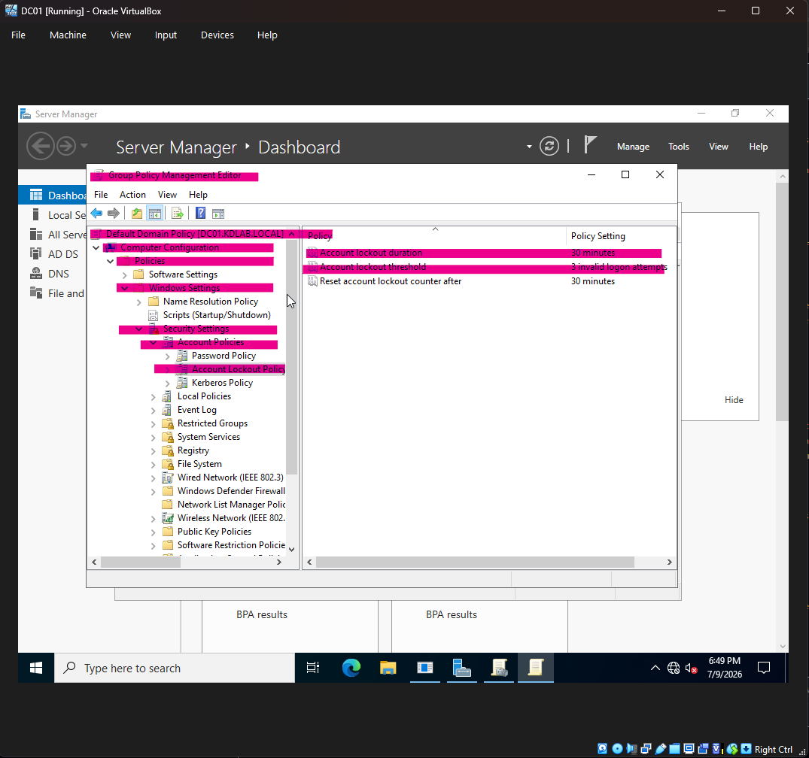

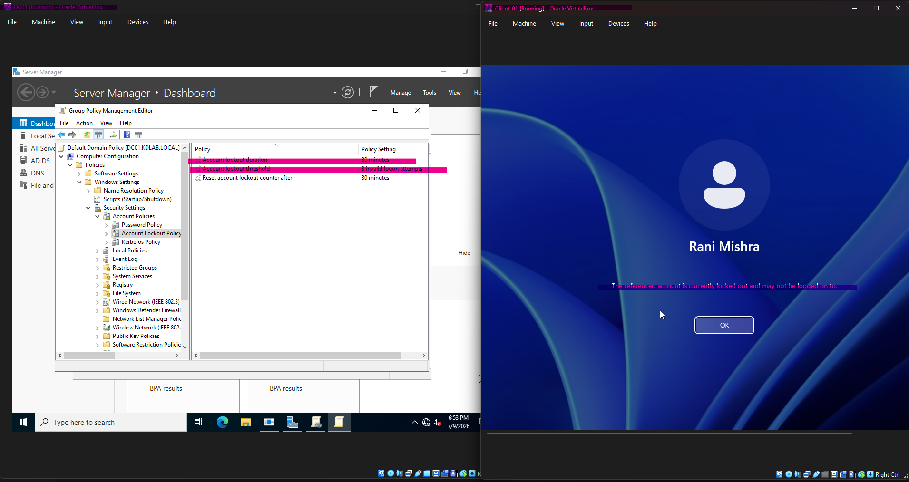

4. To resolve the user lockout, returned to the server AD console (`dsa.msc`), found Rani's properties window, navigated to the **Account** tab, checked the box labeled **"Unlock account"**, and hit Apply to restore her login rights.

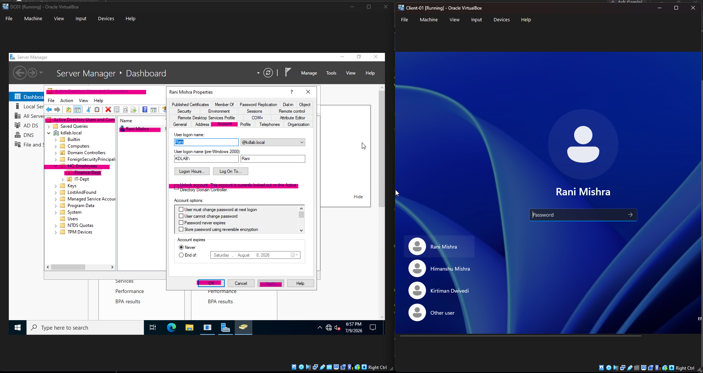

***

### 🎫 Ticket 3: Restricting Access to Control Panel and System Settings
* **Ticket Request:** "Standard non-IT employees are altering local system configurations, messing with display properties, and attempting to modify network adapter parameters. Implement a restriction blocking standard users from accessing the Control Panel or the Windows Settings app entirely."

#### Step 1: Engineering the Control Panel Restriction GPO
1. Opened `gpmc.msc` on the server machine console.
2. Right-clicked the parent container target **`HQ-Employees`** OU, selected **"Create a GPO in this domain, and Link it here..."**, and titled it **`Restrict_Control_Panel_GPO`**.
3. Right-clicked the new GPO asset and chose **Edit...**.
4. Navigated through this specific path: `User Configuration -> Policies -> Administrative Templates -> Control Panel`.
5. Located the policy rule **"Prohibit access to Control Panel and PC settings"**, double-clicked it, set it to **Enabled**, and committed the changes.

#### Step 2: Syncing Configurations and Verifying Compliance on Client
1. Signed into the `Client-01` machine under **Rani Mishra's** standard user account.
2. Opened Command Prompt and initiated a local group policy refresh command: `gpupdate /force`
3. **Verification Output:** Attempted to open the Windows 11 Settings app or search for "Control Panel". The operating system instantly blocked the launch execution, dropping an enterprise restriction alert window stating: **"This operation has been cancelled due to restrictions in effect on this computer."**

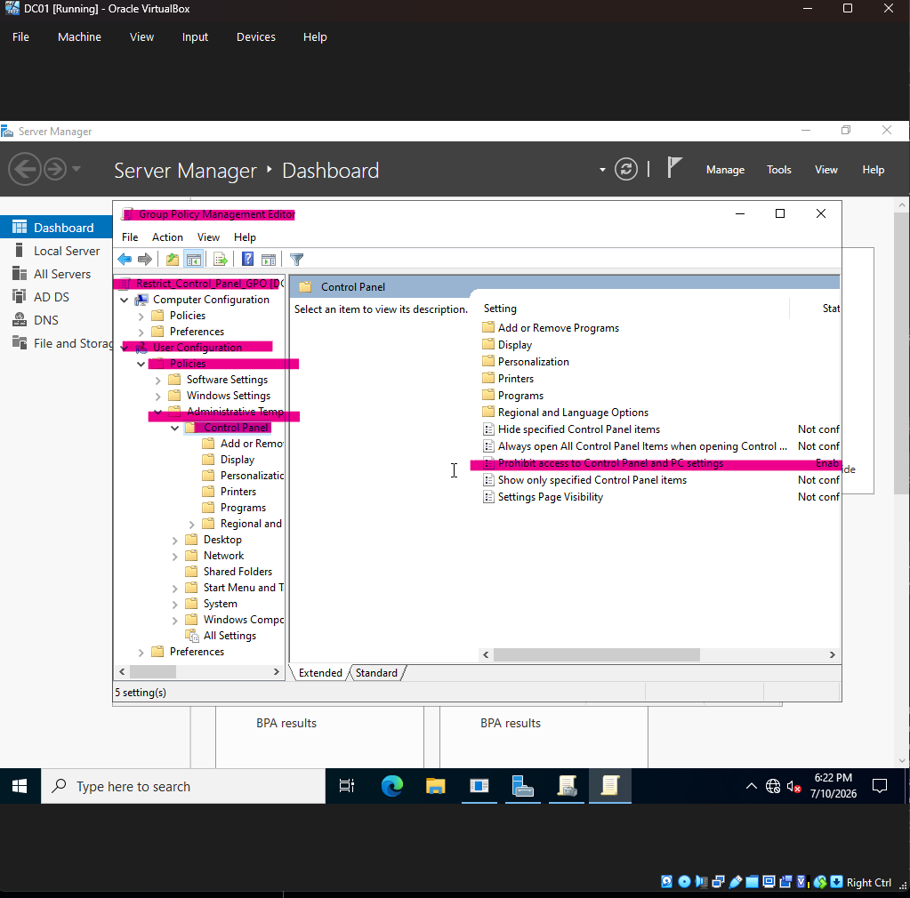

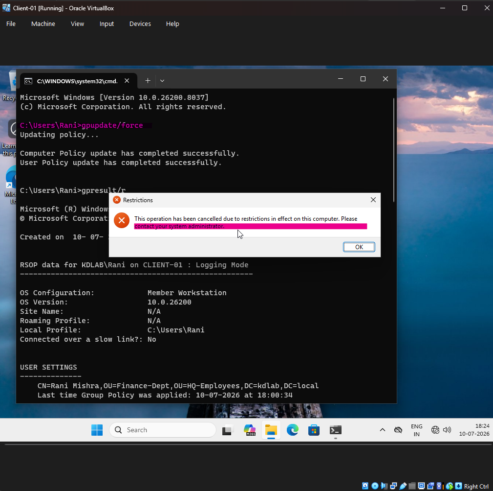

***

### 🎫 Ticket 4: Hypervisor Integration & Endpoint Optimization (Guest Additions Deployment)
* **Ticket Request:** "IT engineering personnel are experiencing workflow bottlenecks due to isolation barriers between physical host engineering devices and the virtualized Windows 11 client workstation. Enable secure cross-environment data transmission, seamless mouse integration, and bidirectional clipboard operations."

#### Step 1: Mounting the Hypervisor Integration Framework
1. Inside the VirtualBox management interface for `Client-01`, accessed the top utility toolbar and navigated to: `Devices -> Insert Guest Additions CD Image...`. Please remember this should be done in the client machine by logging the administrator in my context it will be in other user then login to `kdlab\Administrator`
2. Opened File Explorer inside the Windows 11 workstation, navigated to `This PC`, and double-clicked the virtual optical disk drive initialized as **CD Drive (D:) VirtualBox Guest Additions**.
3. Right-clicked the deployment binary `VBoxWindowsAdditions-amd64.exe` and executed it via **Run as Administrator**.
4. Progressed through the kernel installation wizards to deploy the underlying graphics drivers, mouse pointers filters, and dynamic systems bus adapters.
5. Initiated a mandatory hardware-level restart of the virtual machine.

#### Step 2: Provisioning the Hypervisor Communication Fabric
1. Shut down the client workstation completely to unlock machine hardware configuration locks.
2. Inside VirtualBox Settings for `Client-01`, navigated directly to `General -> Advanced`.
3. Adjusted these two deep communication channels to production testing parameters:
   * **Shared Clipboard:** Switched from *Disabled* to **Bidirectional**
   * **Drag'n'Drop:** Switched from *Disabled* to **Bidirectional**
4. Powered on the virtual machine workstation.

#### Step 3: Operational Verification
1. Logged into the Windows 11 workstation desktop interface.
2. Copied a long string text key from the external physical host system notepad environment.
3. Successfully pasted the clipboard data directly into the virtual machine command prompt terminal, verifying full host-to-guest data bridge functionality.

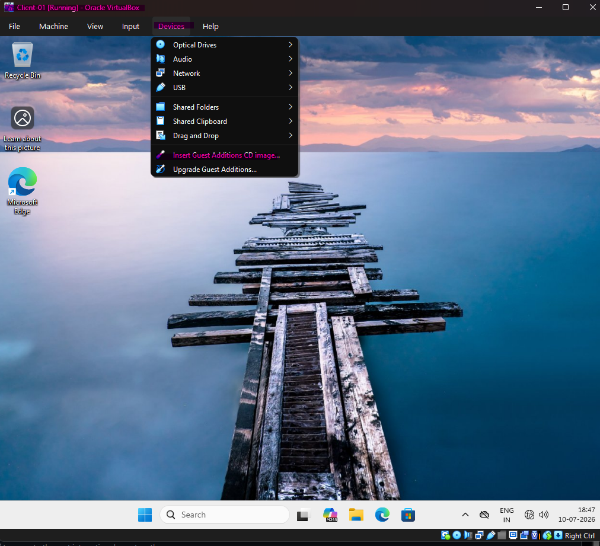

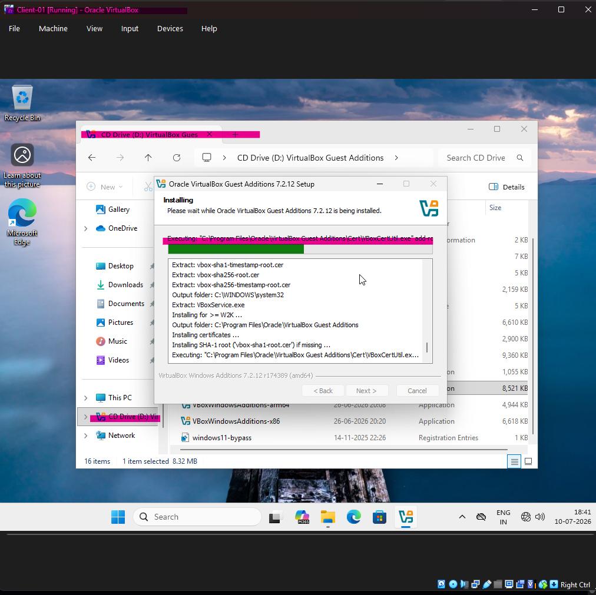

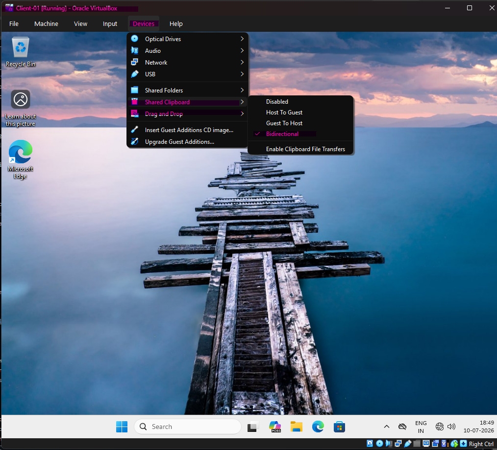

***

### 🎫 Ticket 5: Least-Privilege Access Control (Delegation of Active Directory Administrative Control)
* **Ticket Request:** "Tier 1 Helpdesk personnel require operational capability to reset user passwords and unlock accounts for employees inside the `Finance-Dept` OU. To maintain a strong security posture, these technicians must not be granted global Domain Admin clearance. Delegate scoped administrative rights to the IT support staff."

#### Step 1: Provisioning the Helpdesk Security Group Architecture
1. Opened the Active Directory Users and Computers console (`dsa.msc`) on `DC01`.
2. Navigated to the `IT-Dept` OU, right-clicked an empty space, and selected `New -> Group`.
3. Created a Global Security Group named **`SG-Helpdesk-Staff`**.
4. Opened the properties of the new security group, accessed the **Members** tab, added the domain user account **`Himanshu Mishra`** into the group, and committed the changes.

#### Step 2: Executing Active Directory Permission Delegation
1. Right-clicked directly on the target **`Finance-Dept`** OU container and launched the **Delegate Control Wizard**.
2. Progressed to the Users and Groups selection screen, searched for **`SG-Helpdesk-Staff`**, and added the group to the delegation manifest.
3. On the Tasks to Delegate window, checked the explicit administrative task box: **"Reset user passwords and force password change at next logon"**.
4. Reviewed the access control modification metrics and clicked **Finish** to inject the custom Active Directory Access Control Entries (ACEs).

#### Step 3: Scoped Authorization Testing & Verification
1. Logged into `Client-01` using **Himanshu's** account credentials.
2. Launched an elevated PowerShell terminal interface to simulate remote directory lookup tasks.
3. Executed an administrative password override string targeted at Rani's account object inside the Finance OU to verify authorized clearance:
   `Set-ADAccountPassword -Identity Rani -NewPassword (ConvertTo-SecureString "Dell@123456" -AsPlainText -Force) -Reset`
4. **The Security Proof:** The command executed successfully because of the delegated permission rulebook. Attempted to run the same command against an account object outside of the Finance OU and verified that Active Directory blocked execution with an access denied error, confirming the restriction works flawlessly.

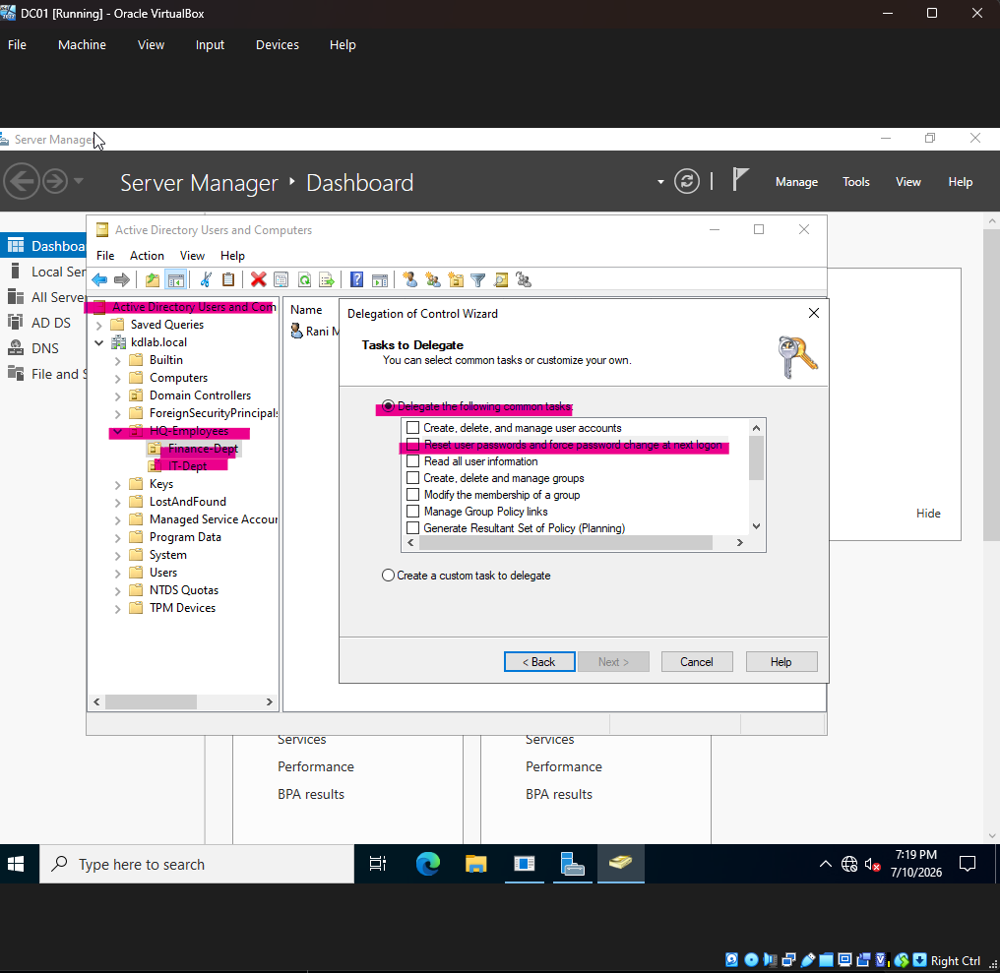

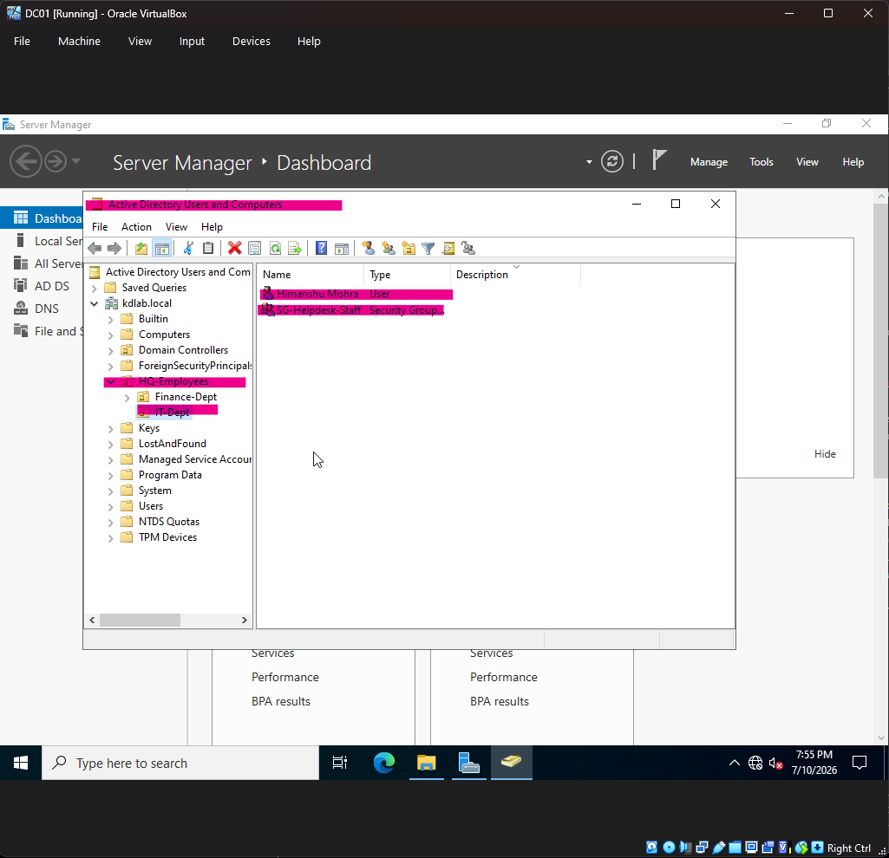

---

*Built by Kirtiman Dwivedi

