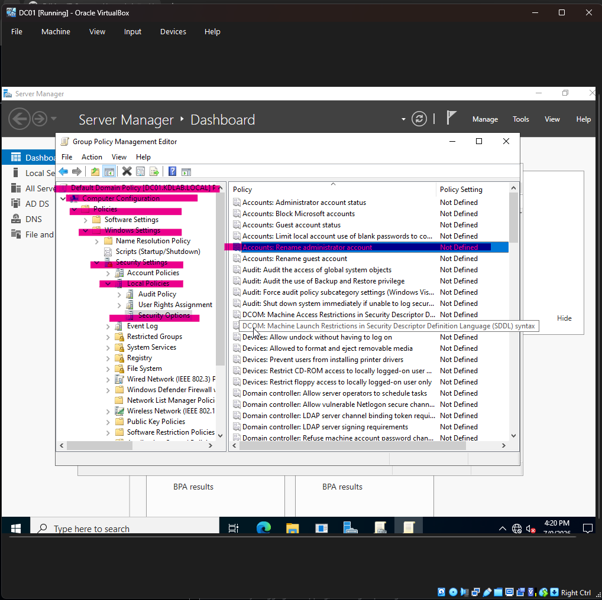

# Technical Deep Dive — Concepts Behind the Lab

This file explains the "why" behind what was built in the main lab. These are not step-by-step instructions — they are the conceptual explanations that help you understand what is actually happening under the hood, and why each design decision was made.

This is useful for interview preparation and for understanding enterprise IT environments more deeply.

---

## Concept 1: Why Does a Domain-Joined Machine Trust Domain Admin Credentials?

When CLIENT01 was joined to `kdlab.local`, something changed silently inside it. Windows automatically added the **Domain Admins** group from the domain controller into CLIENT01's own local **Administrators** group.

This is called **nested group membership**. It means:

- CLIENT01 has its own local Administrators group
- That group now contains `KDLAB\Domain Admins` as a member
- Anyone who is a Domain Admin on DC01 is therefore automatically a local Administrator on CLIENT01

When you log into CLIENT01 with `kdlab\Administrator`, Windows 11 sends the credentials to DC01 for verification. DC01 says "yes, this is a valid domain admin." CLIENT01 then generates an elevated security token (called a **Kerberos ticket**) that gives full local admin rights on that machine.

The machine does NOT become a server. CLIENT01 is still running Windows 11 Pro. The elevated access is purely credential-based — the operating system remains unchanged.

**Why this matters in real IT:**
This is how IT administrators manage thousands of machines remotely. They log in with domain admin credentials and can make changes to any domain-joined machine without having a separate local password for each one. This is also why securing Domain Admin accounts is critical — whoever controls Domain Admins controls every machine in the company.

---

## Concept 2: Local Accounts vs Domain Accounts — Where Do They Live?

### Local Accounts
A local user account (like the `Kirtiman Dwivedi` account created during CLIENT01's initial setup) is stored in a file called the **SAM database** — Security Accounts Manager. This database lives at:

```
C:\Windows\System32\config\SAM
```

It is locked while Windows is running. DC01 has zero knowledge this account exists. You cannot manage it from Active Directory. You cannot apply domain policies to it. If CLIENT01's hard drive dies, that account and all its data are gone.

### Domain Accounts
A domain account (like `himanshu.mishra` or `rani.mishra`) is stored in a file called **ntds.dit** on the domain controller at:

```
C:\Windows\NTDS\ntds.dit
```

This is the Active Directory database. It stores every user, computer, group, and policy in the domain. Because credentials live here centrally, the same username and password works on any domain-joined machine. This is called **Single Sign-On (SSO)**.

**Why this matters in real IT:**
When a new employee joins a company, IT creates one domain account. That one account gives them access to their computer, the shared drives, the printers, and any other network resource they have permission for — all with one login. When they leave, disabling that one account cuts off all access immediately. This is Identity and Access Management (IAM) in its most basic form.

---

## Concept 3: How NTFS Permissions and SMB Permissions Work Together

When you share a folder over the network, two separate permission layers control who can access it:

### Layer 1 — Share Permissions (Network Gateway)
Share permissions control who can connect to the shared folder over the network at all. These are set in the Sharing tab → Advanced Sharing → Permissions.

In this lab, I set Share Permissions to **Everyone: Full Control**. This sounds dangerous but it is the standard practice. The share permission is just the outer door — it lets anyone who is on the network at least knock. The real access control happens at the next layer.

### Layer 2 — NTFS Permissions (The Real Lock)
NTFS permissions control what each user can actually do once they are inside the share. These are set in the Security tab of the folder properties.

When a user accesses a shared folder, Windows applies **both** permission layers and gives the user whichever is more restrictive. So:
- Share says: Everyone gets Full Control
- NTFS says: Only Himanshu gets Modify on IT-Data

Result: Himanshu gets Modify access. Everyone else gets nothing because NTFS blocks them.

**Why you disable inheritance:**
When I created `IT-Data` inside `CompanyShares`, it automatically inherited permissions from its parent folder (the `Everyone: Full Control` share setting would flow down). Disabling inheritance breaks that connection and lets me set strict, custom permissions on each subfolder independently.

This is the correct way to configure departmental shares in a real corporate environment.

---

## Concept 4: What Group Policy Actually Does

Group Policy is how IT administrators push rules and settings to hundreds or thousands of computers and users automatically, without visiting each machine.

A **Group Policy Object (GPO)** is a collection of settings. You create a GPO, configure the settings inside it, then **link** it to an OU. Every user or computer inside that OU gets those settings applied automatically the next time they log in or run `gpupdate /force`.

### Two types of settings inside a GPO:

**Computer Configuration** — Settings that apply to the machine regardless of who logs in. Examples: account lockout policy, firewall rules, startup scripts.

**User Configuration** — Settings that follow the user regardless of which machine they log into. Examples: Control Panel restrictions, desktop wallpaper enforcement, drive mappings.

### How Group Policy is applied (the processing order):
1. Local policy (on the machine itself)
2. Site-level GPOs
3. Domain-level GPOs
4. OU-level GPOs (most specific, wins over the others if there is a conflict)

This order is called **LSDOU** — Local, Site, Domain, OU.

**Why this matters in real IT:**
When a user says "I cannot open Control Panel" or "my desktop wallpaper keeps resetting," the answer is almost always Group Policy. Knowing how to find which GPO is applying which setting (using `gpresult /r` in CMD) is a daily L1 and L2 skill.

---

## Concept 5: What Delegation of Control Actually Grants

The Delegate Control Wizard in Active Directory does not give someone a new role. It modifies the **Access Control List (ACL)** on the OU object itself.

When I delegated "Reset user passwords and force password change at next logon" to `SG-Helpdesk-Staff` on the Finance-Dept OU, Active Directory added specific **Access Control Entries (ACEs)** to that OU:

```
SG-Helpdesk-Staff → ALLOW → Reset Password → on User objects → within Finance-Dept OU only
```

This is stored in AD and checked every time Himanshu tries to run a password reset command. If he targets an account in Finance-Dept, AD checks the ACL and sees his group has permission — request allowed. If he targets an account in IT-Dept or any other OU, AD checks the ACL there and sees no entry for his group — request denied.

**Why this matters in real IT:**
The principle of Least Privilege — give people only the access they need to do their job, nothing more. Helpdesk staff should not have Domain Admin rights just to reset passwords. Delegation of Control lets IT managers give precise, scoped permissions. This is a direct cybersecurity principle and comes up in GRC (Governance, Risk, Compliance) discussions as well.

---

## Concept 6. Infrastructure Security Hardening: The Administrator Rename Protocol
Hacker scripts regularly target the default username "Administrator" during automated network brute-force attacks. To eliminate this security vector, the master account name can be obscured using two production techniques:

#### Option A: Global Workstation Lockdowns via GPO (Changes Client Local Admin Accounts)
1. Opened the **Group Policy Management Editor** on `DC01`.
2. Drilled down to: `Computer Configuration -> Policies -> Windows Settings -> Security Settings -> Local Policies -> Security Options`.
3. Located the policy rule: `Accounts: Rename administrator account` and double-clicked it.
4. Checked the validation box labeled **"Define this policy setting"** to unlock the configuration field.
5. Provided a secure, custom name (e.g., `KD-Admin` or `LabAdmin`) and committed the settings change.




#### Option B: Active Directory Direct Rename (Changes the Domain Controller Master Account Name)
1. Opened **Active Directory Users and Computers** on the server.
2. Navigated to the default **Users** folder interface.
3. Right-clicked the literal user object labeled **Administrator** and executed a direct **Rename** command.
4. Inputted the secure identity identifier (e.g., `KDAdmin`), pressed Enter, and confirmed the updated login string mappings within the verification window.


---


## Concept 7: What APIPA Addresses Mean and Why They Appear

When Windows cannot contact a DHCP server, it assigns itself an address in the range `169.254.0.1` to `169.254.255.254`. This is called an **APIPA address** — Automatic Private IP Addressing.

APIPA exists so the computer has some IP address even when DHCP fails. But an APIPA address is useless for reaching any other network device (except other machines on the same local segment that also have APIPA). It cannot reach the internet. It cannot reach the domain controller. It cannot reach shared drives.

### What causes APIPA to appear:
- The DHCP server is down
- The DHCP scope is exhausted (no more IPs to hand out)
- The machine's network cable is physically unplugged
- The network adapter has a driver problem

### The diagnostic sequence when you see 169.254.x.x:
1. Check the physical cable or WiFi connection first
2. Run `ipconfig /release` then `ipconfig /renew` — if DHCP is working, this fixes it immediately
3. If `ipconfig /renew` fails with "Unable to contact DHCP server" — the problem is on the server side
4. Go to the DHCP server and check if the service is running and the scope is active

**Why this matters in real IT:**
APIPA is one of the first things every L1 engineer learns to recognise. Seeing `169.254.x.x` in an `ipconfig /all` output is a direct, immediate signal that DHCP has failed. No guessing required.

---

## Concept 8: Kerberos Authentication — How Domain Logins Actually Work

When a user logs into a domain-joined machine, the following happens in the background:

1. The user enters their username and password on CLIENT01
2. CLIENT01 sends an authentication request to DC01 (the Key Distribution Center — KDC)
3. DC01 verifies the credentials against its ntds.dit database
4. DC01 issues a **Ticket Granting Ticket (TGT)** — a time-stamped token proving the user is who they say they are (valid for 10 hours by default)
5. When the user tries to access a resource (a shared folder, a printer), their machine presents the TGT to DC01 and asks for a **Service Ticket** for that specific resource
6. DC01 issues the Service Ticket, which the user presents to the resource server
7. The resource server validates the ticket without calling DC01 again

The user never sends their actual password across the network after the initial authentication. Only encrypted tickets travel across the wire.

**Why this matters in real IT:**
This is why you cannot log into a domain account when the domain controller is unreachable — there is no one to issue the ticket. It is also why Kerberos errors (Event ID 4768, 4769, 4771) appear in Event Viewer during authentication problems. Understanding the ticket-based flow helps you diagnose "I can log in locally but not to the domain" problems.

---

## Concept 9: Event IDs You Should Know for L1 Support

Event Viewer logs everything. These are the Event IDs that come up most often in real helpdesk work:

| Event ID | Meaning | Log Location |
|---|---|---|
| 4624 | Successful logon | Security |
| 4625 | Failed logon attempt | Security |
| 4740 | User account locked out | Security |
| 4720 | New user account created | Security |
| 4722 | User account enabled | Security |
| 4725 | User account disabled | Security |
| 6005 | Event Log service started (system boot) | System |
| 6006 | Event Log service stopped (clean shutdown) | System |
| 6008 | Unexpected shutdown (crash or power loss) | System |
| 41 | Kernel-Power — system rebooted without clean shutdown | System |
| 7034 | A service terminated unexpectedly | System |

**How to filter for a specific Event ID:**
Open Event Viewer → Windows Logs → Security (or System) → right-click → Filter Current Log → type the Event ID number.

This is exactly what you would do during Ticket 06 to find the lockout event for Rani Mishra.

---

## Concept 10: Why the SAM Database Backup Account Should Be Deleted After Domain Join

When CLIENT01 was first set up as a standalone Windows 11 machine, the local account `Kirtiman Dwivedi` was created. After joining the domain, this account still exists in the SAM database on CLIENT01's local drive.

Leaving unused local accounts on domain-joined machines creates security risks:
- If someone gains physical access to the machine, they can boot into the local account and bypass domain policies entirely
- The local account is not managed by Active Directory — no password expiry, no audit trail in the domain logs
- It takes up disk space with a full user profile folder at `C:\Users\Kirtiman Dwivedi`

**Correct process to remove it:**
1. Log in to CLIENT01 as `kdlab\Administrator` (domain admin)
2. Open `sysdm.cpl` → Advanced tab → User Profiles → Settings → delete the local profile
3. Then open Computer Management → Local Users and Groups → Users → delete the local account

Always delete the profile first, then the account. Deleting the account first leaves orphaned profile files on the disk.

---


*This document is a companion to the main lab README. It is meant for deeper study and interview preparation.*

